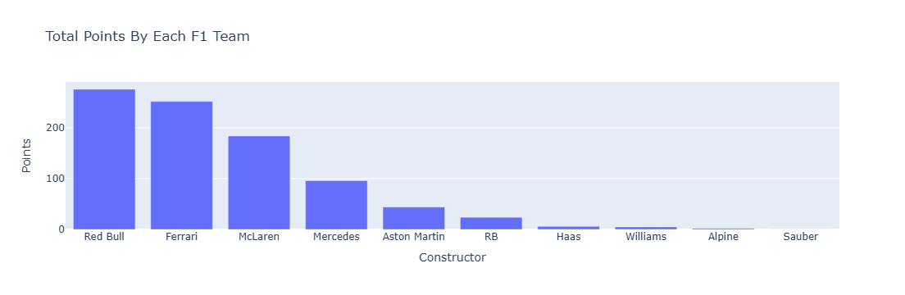

#F1 2024 Performance Analysis

## Objective
To analyze race-wise and team-wise performance in the 2024 Formula 1 season using data-driven methods.

## Dataset
The dataset contains race-wise points scored by drivers and constructors during the 2024 F1 season.
Each race was originally represented as a separate column and was converted into an analysis-ready format.

## Methodology
Loaded and inspected the dataset using Pandas
Converted wide race data into long format using 'melt()`
Cleaned missing values related to non-participation
Aggregated constructor performance per race using 'groupby0
Identified team dominance patterns across races

## Tools Used
Python
Pandas
Plotly (for visualization)

## Key Insight
Team dominance varies across circuits rather than remaining constant throughout the season.
Consistent constructor performance across multiple races plays a critical role in championship outcomes.

## Future Work
Driver consistency analysis
Time-series based performance comparison
Extension to vehicle telemetry-style datasets

## Visual Insights

### Team Points Distribution

